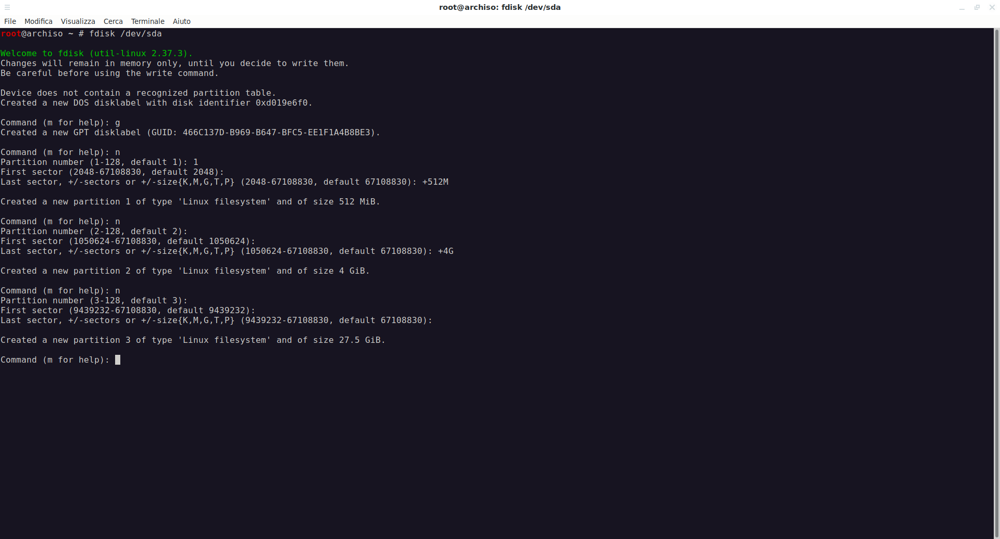

# README
I'm trying to find a way: still again a work in progress...

* Created 12/2/2022 forking [Medirim/dotfiles](https://github.com/Mederim/dotfiles)
* Update 13/2/2022 following [K1SS - KISS Linux 9.2 UEFI Installation - Kernel 5.9.8
](https://www.youtube.com/watch?v=kZYcfT0WcCo)
* Started to follow [Mederim/kiss-waydroid](https://github.com/Mederim/kiss-waydroid)


* Update 13/2/2022 following [K1SS - KISS Linux version 2021.7-9 UEFI Installation - Kernel 5.14.8
](https://www.youtube.com/watch?v=QCjjFqC-Ve8&t=0s)


# Premilary

## Download archiso
You can downloads last [Arch Linux install](https://archlinux.org/download/) and follow the instructions.

```
pacman -Sy
pacman -S wget
systemctl start sshd
passwd
ip a
```

Open a terminal and connect:

```
ssh root@192.168.61.101
fdisk /dev/sda
```


It's very import set the type of partitions with the command t, You must get something like this:
```
Device       Start      End  Sectors  Size Type
/dev/sda1     2048  1050623  1048576  512M EFI System
/dev/sda2  1050624  9439231  8388608    4G Linux swap
/dev/sda3  9439232 67108830 57669599 27.5G Linux root (x86-64)
```
At this point write the changemennt on the disk with the command 'w'.

## Formatting disk

```
mkfs.fat -F32 /dev/sda1 
mkswap /dev/sda2
swapon /dev/sda2
mkfs.ext4 /dev/sda3
```

## Mounting 
```
mount /dev/sda3 /mnt
mkdir /mnt/boot
mount /dev/sda3 /mnt/boot
```


# [001] Install KISS

```                                                                            |
ver=2021.7-9
url=https://github.com/kisslinux/repo/releases/download/$ver
file=kiss-chroot-$ver.tar.xz
```

# [002] Download The Installation Tarball
```
curl -fLO "$url/$file"
```

# [003] Verify Checksums
```
curl -fLO "$url/$file.sha256"   
sha256sum -c < "$file.sha256"
```
# [004] Verify Signature

```
curl -fLO "$url/$file.asc"
gpg --keyserver keyserver.ubuntu.com --recv-key 13295DAC2CF13B5C
gpg --verify "$file.asc"                                               
```

# [005] Unpack The Tarball
```
cd /mnt 
tar xvf "$OLDPWD/$file"
```

From host
```
genfstab /mnt >> /mnt/etc/fstab

nano /mnt/etc/profile.d/kiss_path.sh
```
And copy and past inside:

```
export CFLAGS="-O3 -pipe -march=native"
export CXXFLAGS="$CFLAGS"
export MAKEFLAGS="-j4"
#export XDG_RUNTIME_DIR=/tmp
#export MOZ_WAYLAND_DRM_DEVICE=/dev/dri/renderD128
export KISS_PATH=''
KISS_PATH=$KISS_PATH:/var/repo/core
KISS_PATH=$KISS_PATH:/var/repo/extra
KISS_PATH=$KISS_PATH:/var/repo/wayland
KISS_PATH=$KISS_PATH:/var/community/community
#if [ -z $DISPLAY ] && [ "$(tty)" = "/dev/tty1" ]; then
#	  exec sway
#fi
```

# [006] Enter The Chroot
```
/mnt/bin/kiss-chroot /mnt
```

# [007] Setup Official Repositories

```
git clone https://github.com/kisslinux/repo
sudo mv repo /var/

git clone https://github.com/kiss-community/community
sudo mv community /var

```
# [009] Set KISS_PATH

We did it previusly..

# [010] Enable Signature Verification
# [011] Build And Install GPG 
```
kiss build gnupg1
```

# [012] Import (Dylan Araps') Key 
```
gpg --keyserver keyserver.ubuntu.com --recv-key 13295DAC2CF13B5C
echo trusted-key 0x13295DAC2CF13B5C >>/root/.gnupg/gpg.conf
```

# [013] Enable Signature Verification
```
cd /var/repo
git config merge.verifySignatures true  
```

# [014] Rebuild The System
# [015] Modify Compiler Flags (Optional)
We did it previusly.

```
export CFLAGS="-O3 -pipe -march=native"                                |
export CXXFLAGS="$CFLAGS"
export MAKEFLAGS="-j4"
```

# [016] Update All Base Packages To The Latest Version
```
kiss update
```

kiss update the first update the package manager, the second it's necessary to build all the remain.

```
kiss update
```


# [017] Rebuild All Packages
This operation can be done also after the installation,

```
cd /var/db/kiss/installed && kiss build *
```

We get the error:
```
pigz-2.6 not founf
```
to correct it, from host console:
```
cd /mnt/var/repo/core/pigz
nano version
```
change the version 2.6 2 to 2.7 2, then:

from chroot 

```
cd /var/repo/core/pigz
kiss checksum
```
then, again try to build:

```
cd /var/db/kiss/installed && kiss build *
```

Installing some others
```
kiss b e2fsprogs
kiss b dosfstools
kiss b xfsprogs // manca
```
device manager

```
kiss b util-linux
kiss b eudev 
```

dhcp
```
kiss b dhcpcd
mkdir -p /etc/rc.d 
echo "dhcpcd 2> /dev/null" > /etc/rc.d/dhcpcd.boot
```
hostname
```
echo "kisslinux" > /etc/hostname
```
kiss b libelf
kiss b ncurses
kiss b perl
```

# [018] The Kernel

from the host
```
cd /mnt/root
wget https://cdn.kernel.org/pub/linux/kernel/v5.x/linux-5.16.4.tar.xz
```
```
tar xvf linux-5.16.4.tar.xz
cd linux-5.16.4

```
make defconfig
```
ci crea .config


```
lspci -k
```

from make help 

see localyesconfig
```
 Update current config converting local mods to core except those preserved by LMC_KEEP environment variable
```

so:
```
make localyesconfig
```

## Puttana EVA!!!
Compiliamo l'accrocco...

```
make -j "$(nproc)"
```


```
make INSTALL_MOD_STRIP=1 modules_install   
```

# [028] Install Kernel Image -
```
make install
mv /boot/vmlinuz    /boot/vmlinuz-VERSION
mv /boot/System.map /boot/System.map-VERSION 
```
# [029] Install Required Packages

[030] Install init Scripts

```
kiss b baseinit
```

## [031] The Bootloader
UEFI

```
kiss b efibootmgr
```
To use efibootmgr and other software to manipulate the UEFI boot entries, the
efivars filesystem must be mounted. This isn't handled automatically by KISS
due to the security implications in doing so.

```
mount -t efivarfs none /sys/firmware/efi/efivars/
```

```
efibootmgr \
	--disk /dev/sda \
	--part 1 \
	--create \
	--label "KISS" \
	--loader /vmlinuz \
	--unicode 'root=PARTUUID=a0b9f6a0-4479-8d46-bb4d-e2ab76d00510 rw' \
	--verbose
```


# BIOS

this is just for BIOS and my case

```
kiss b grub
```

```
grub-install --target=i386-pc /dev/sda
grub-mkconfig -o /boot/grub/grub.cfg
```

## [032] Filesystem Utilities


